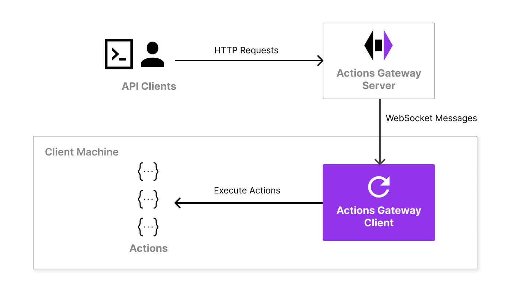
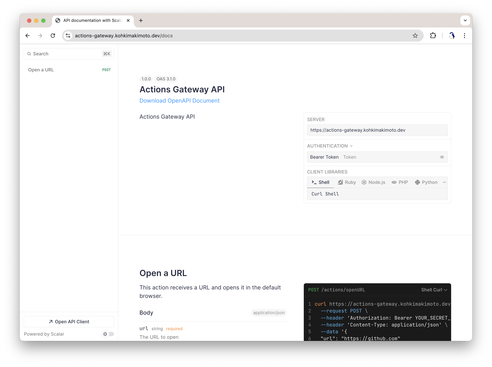

# Actions Gateway

[](https://github.com/kohkimakimoto/actions-gateway/actions/workflows/test.yml)
[](https://github.com/kohkimakimoto/actions-gateway/blob/main/LICENSE)

<p align="center">
  
</p>

<p align="center">An API server that allows running local programs through HTTP requests.</p>

## Introduction

Actions Gateway is an open source API server application written in Go that allows arbitrary programs on your local machine to be executed via an HTTP API.
It works with a client program installed on your local machine. The client acts as an agent, enabling remote execution of these programs over the internet.

Initially, it was developed for [GPT Actions](https://platform.openai.com/docs/actions/introduction) in ChatGPT to enable the online AI to execute local programs.
However, the core functionality of the Actions Gateway is versatile and can be adapted for many other purposes.

### How does Actions Gateway work?

Actions Gateway consists of two main components: the server and the client.

<p align="center">
  
</p>

- **Server (Actions Gateway server)** is typically deployed on the internet to receive HTTP API requests and forward them to the client via an established WebSocket connection.

- **Client (Actions Gateway client)** is a program that runs on your local machine. It starts the agent process, connects to the server, and maintains a persistent connection. Through this connection, it processes requests forwarded by the server and executes specified programs (called "Actions") on the local machine.

## Getting Started

The following sections provide brief instructions on how to get started with Actions Gateway.
I recommend reading them in order if you are a new user.

The easiest way to get started with Actions Gateway is by using a free managed server provided by the author.
The following instructions assume you are using this server.

Alternatively, you can deploy it to your own server. In both cases, installing the `actions-gateway` command is required.
This single binary includes both client and server components.

### Installation

The `actions-gateway` command is available for Linux and macOS. You can download the latest version from the [releases page](https://github.com/kohkimakimoto/actions-gateway/releases/latest)
After downloading the appropriate archive for your platform, extract it and move the `actions-gateway` binary to a directory in your PATH.

### Setup configuration and actions

After installing the `actions-gateway` command, you need to set up the configuration and actions.
It provides an initialization command to help with this process. Run the following command:

```sh
actions-gateway init
```

This command usually creates a directory `~/.config/actions-gateway`.
This directory contains the configuration file `config.toml` and a `actions` subdirectory.

Move to the `~/.config/actions-gateway` directory and open the `config.toml` file in your favorite text editor.
It is a configuration file for the Actions Gateway client.

First, check the `server` key in the file.

```toml
# The server url that the client connects to.
# The following server is a free public server that is hosted by the author.
server = "https://actions-gateway.kohkimakimoto.dev"
```

The `server` key specifies the URL of the Actions Gateway server that you want to connect to.
The pre-configured value is a free managed server provided by the author.
Using this server is the easiest way to get started, because you don't need to deploy the Actions Gateway server on your own.

### Get a token

To connect to the Actions Gateway server, you need a token for authentication.
The `https://actions-gateway.kohkimakimoto.dev` server provides a web interface to get a token.
Please visit the following URL:

https://actions-gateway.kohkimakimoto.dev/new-token

Click the "Generete new token" button in the web interface.
After getting the token, set it to the `token` key in the `config.toml` file.

```toml
# This is a token for authentication.
# To get the token, you can use the 'actions-gateway new-token' command.
token = "replace-me-with-your-token..."
```

### Start the client agent

You are now ready to connect to the Actions Gateway server.
Start the client agent with the following command:

```sh
actions-gateway start
```

If the client agent successfully connects to the server, you will see the following message:

```
Connected to the server: https://actions-gateway.kohkimakimoto.dev/
```

This message indicates that the client agent is now connected to the server and ready to execute actions via the server API.

### Run an action via server API

The [initial setup](#setup-configuration-and-actions) creates an example action named `openURL` that simply opens a URL in your default web browser. You can execute it using the following cURL command (Don't forget to replace `<your-token>` with your actual token):

```sh
curl -XPOST https://actions-gateway.kohkimakimoto.dev/actions/openURL \
  -H 'Content-Type: application/json' \
  -H 'Authorization: Bearer <your-token>' \
  -d '{"url": "https://github.com"}'
```

If the action is executed successfully, the above command opens the URL `https://github.com` in your default web browser.
This demonstrates that **Actions Gateway can execute local programs on your machine via the server API**.

> :information_source: The `openURL` action is implemented as a bash script. You can view its code in the file located at `~/.config/actions-gateway/actions/openURL`.

### OpenAPI documentation

Actions Gateway is an API server and provides an OpenAPI interface.
You can access the OpenAPI interactive documentation by visiting the following URL:

https://actions-gateway.kohkimakimoto.dev/docs

This page requires [Basic Authentication](https://en.wikipedia.org/wiki/Basic_access_authentication). Enter your token as the username and leave the password blank. You can see the list of available actions and their API schemas in the OpenAPI documentation.

<p align="center">
  
</p>

### Well done!

You have successfully set up Actions Gateway and executed an action through the server API.
Here are the next steps you can take:

- [Add your own actions](#actions).
- [Using with ChatGPT](#using-with-chatgpt).
- [Deploy your own Actions Gateway server](#server).

The following sections provide detailed information about using Actions Gateway.

> :exclamation: Disclaimer
>
> The free Actions Gateway server `actions-gateway.kohkimakimoto.dev` uses SSL/TLS encryption to protect communications from eavesdropping and tampering by third parties. However, the server process can access raw requests, making all requests readable within the server.
>
> Therefore, it is not recommended to send confidential information through `actions-gateway.kohkimakimoto.dev`. Please note that I cannot guarantee the security and operation of the server.
>
> If you need to handle sensitive data, consider self-hosting your own Actions Gateway server.

## CLI

Actions Gateway is implemented as a single binary CLI: `actions-gateway` that includes both the client and server components.

To see the available commands, just run `actions-gateway` without any arguments:

```sh
Usage: actions-gateway [global options] command [command options]

An API server that allows running local programs through HTTP requests.

Commands:
   gojq       built-in gojq command
   init       Initialize a client config directory
   logs       Show the logs of the client agent
   new-token  Generate a new token
   serve      Start the server process
   spec       Output the OpenAPI spec of your actions
   start      Start the client agent to connect to the server
   status     Show the status of the client agent
   stop       Stop the client agent daemon process
   help, h    Shows a list of commands or help for one command

Global options:
   --help, -h     show help
   --version, -v  print the version
```

### Command: gojq

The `gojq` command executes the built-in [gojq](https://github.com/itchyny/gojq), a Go-based implementation of the jq command.

It is a utility tool for processing JSON data. You can use it when implementing [Actions](#actions) in shell scripts.

#### Examples

The following shell script code extracts the `url` field from the JSON input like `{"url": "https://example.com"}`.

```sh
input=$(cat -)
url=$(echo "$input" | actions-gateway gojq -r '.url')
```

For more information, see the [gojq repository](https://github.com/itchyny/gojq).

### Command: init

The `init` command creates a new client configuration directory.

#### Options

- `--directory <directory>, -d <directory>`: The directory path to create. The default is `$XDG_CONFIG_HOME/actions-gateway` (If `$XDG_CONFIG_HOME` is set) or `$HOME/.config/actions-gateway`.

### Command: logs

The `logs` command shows the logs of the client daemon.

When you [start](#command-start) the client agent as a daemon, you need to set the `log_file` parameter in the config file.
Action Gateway will then write logs to that file.
You can view these logs using the `logs` command.

#### Options

- `--follow, -f`: Follow the log output.
- `--config <file>, -c <file>`: Path to the [client config file](#configuration).

### Command: new-token

The `new-token` command generates a new [token](#tokens) for authentication.

#### Options

- `--local, -l`: Generate a new token without connecting to the server (default: false). By default, this command connects to the server that is specified in the config to get a new token. If you set this option, it prompts you to enter the secret to generate a new token locally.
- `--config <file>, -c <file>`: Path to the [client config file](#configuration).

### Command: serve

The `serve` command starts the Actions Gateway server. For more details, see the [Server](#server) section.

#### Options

- `--server-config <file>`: The configuration file for the server.

### Command: spec

The `spec` command outputs the OpenAPI specification of your actions. For more details, see the [Actions](#actions) section.

#### Options

- `--config <file>, -c <file>`: Path to the [client config file](#configuration).

### Command: start

The `start` command starts the agent to connect to the server. For more details, see the [Agent](#agent) section.

#### Options

- `--config <file>, -c <file>`: Path to the [client config file](#configuration).
- `--daemon, -d`: Run as a daemon (background) process (default: false)

### Command: status

The `status` command shows the status of the client agent.

In order to use this command, you need to set the `status_file` parameter in the config file.

#### Options

- `--config <file>, -c <file>`: Path to the [client config file](#configuration).

### Command: stop

The `stop` command stops the client agent daemon process.

This command is only used when you start the client agent as a daemon.

#### Options

- `--config <file>, -c <file>`: Path to the [client config file](#configuration).

## Client

### Agent

When you run the [`actions-gateway start`](#command-start) command, the client starts an agent process.
It is a long-running process that connects to the server and waits for requests to execute actions.

When the client agent starts, it sends a [token](#tokens) and specifications of [actions](#actions) to the server.
The Actions Gateway server receives them and generates API endpoints for each action.
These endpoints are connected to the client agent, and incoming requests are relayed back to the client.
This mechanism allows API requests to execute actions on the client machine.

#### Daemon mode

Actions Gateway client has built-in support for running the agent as a daemon.
When you run the `actions-gateway start` command with the `--daemon` option, the client agent runs in the background as a daemon process.
If you run the agent as a daemon, you have to set the `status_file`, `pid_file`, and `log_file` parameters in the config file.

After starting the agent as a daemon, you can use several commands to manage the daemon process:

- [`actions-gateway status`](#command-status): Show the status of the client agent.
- [`actions-gateway stop`](#command-stop): Stop the client agent daemon process.
- [`actions-gateway logs`](#command-logs): Show the logs of the client agent.


### Configuration

The Actions Gateway client, by default, searches for the configuration file in several locations.
The order of precedence is as follows:

1. The path specified by the `--config` option.
1. `$XDG_CONFIG_HOME/actions-gateway/config.toml`
1. `$HOME/.config/actions-gateway/config.toml`
1. `$HOME/.actions-gateway/config.toml`

The configuration file is written in the [TOML](https://toml.io/en/) format.

#### Examples

```toml
# The server url that the client connects to.
# The following server is a free public server that is hosted by the author.
server = "https://actions-gateway.kohkimakimoto.dev"

# This is used as the server URL in the OpenAPI specification.
# The default value is the same as the "server" config.
# See also: https://swagger.io/docs/specification/v3_0/api-host-and-base-path/
server_api_url = "https://actions-gateway.kohkimakimoto.dev"

# This is a token for authentication.
# To get the token, you can use the 'actions-gateway new-token' command.
token = "..."

# This is the directory that contains the actions.
# If it is a relative path, it will be relative to the directory where the config file is located.
# The default value is "actions".
actions_dir = "actions"

# This is the status file path.
# The status file is used to store the status of the client connection to the server.
# It is also required when you connect to the server as a daemon.
# If it is a relative path, it will be relative to the directory where the config file is located.
status_file = "status.json"

# This is the pid file path.
# The pid file is only used (and required) when you connect to the server as a daemon.
# If it is a relative path, it will be relative to the directory where the config file is located.
pid_file = "client.pid"

# This is the log file path.
# The log file is only used (and required) when you connect to the server as a daemon.
# If it is a relative path, it will be relative to the directory where the config file is located.
log_file = "client.log"

# This is the maximum number of reconnection attempts.
# The default value is 10.
max_reconnect_attempts = 10

# This is the maximum backoff time in seconds.
# The default value is 32.
max_reconnect_backoff = 32

# This is the info object config of the OpenAPI spec.
# See more detail: https://swagger.io/specification/#info-object
# Currently, only the following fields are supported.
spec_info.title = "Actions Gateway API"
spec_info.summary = "Actions Gateway API"
spec_info.description = "Actions Gateway API"
spec_info.version = "1.0.0"
```

### Tokens

Tokens in the Actions Gateway are used for authenticating connections to the server.
They are included in the HTTP header for Bearer authentication.

When a client agent connects to the server, the token is sent.
The server generates API endpoints for each action, and these endpoints require verification using the same token.
To use the generated API endpoints, include the token in the HTTP header.

Technically, tokens are JWTs (JSON Web Tokens) signed with an HS256 secret key.
So, you can generate a token in the following ways:

1. Generating on the server.
1. Generating locally.

#### Generating tokens on the server

The Actions Gateway server has the HS256 secret key to verify tokens.
It means that the server can generate tokens for you.

To generate a token on the server, you can use the `actions-gateway new-token` command.

```sh
actions-gateway new-token
```

This command connects to the server specified in [config](#configuration) and generates a new token.
Alternatively, you can use a web GUI by visiting the `/new-token` path with your browser. This method is described in the [Get a token](#get-a-token) section.


#### Generating tokens locally

If you host your own Actions Gateway server, you might want to disable the token generation feature to prevent unauthorized users from accessing your server.

In this case, you can generate a token locally using the `actions-gateway new-token --local` command.

```sh
actions-gateway new-token --local
```

This command prompts you to enter a secret key. After entering the secret key, it generates a new token locally.

### Actions

Actions are programs that run on the client machine.
They must be located in the `actions_dir` directory specified in the [config](#configuration) file.

You can write actions in any programming language.
However, to work with Action Gateway, they must meet the following requirements:

- The action must be an executable file.
- The action must output a portion of a YAML-formatted OpenAPI schema that describing the action's endpoint to stdout when it detects the `$ACTIONS_GATEWAY_ACTIONS_SPEC=1` environment variable.

Since actions are executed via HTTP requests, they have the following specifications:

- The HTTP request body is passed to the action's stdin.
- The action's stdout is returned as the HTTP response body.

#### Examples

See the [`openURL`](./builtin/openURL) action for an example.
It is a simple action that opens a URL in your default web browser.

## Server

The Actions Gateway server is a component that receives HTTP requests and forwards them to the client agent. It can be started using the [`actions-gateway serve`](#command-serve) command.

### Configuration

The Actions Gateway server requires a configuration. The configuration comes from either the file (TOML format) specified by the `--server-config` option or environment variables.

#### Parameters

- `addr` (string): The address to listen on. Defaults to `:18800`.
- `url` (string): The base URL of the server. Defaults to `http://localhost:18800`.
- `secret` (string): An HS256 secret key. It must be at least 32 characters long.
- `expose_new_token` (bool): Whether to expose the `/new-token` and `/api/new-token` endpoints. Defaults to `false`.
- `debug` (bool): Whether to enable debug logging. Defaults to `false`.

#### Examples

TOML configuration file:

```toml
addr = ":80"
url = "https://actions-gateway.kohkimakimoto.dev"
secret = "eyJ..."
expose_new_token = true
debug = false
```

You can set the same configuration using environment variables:

```sh
export ACTIONS_GATEWAY_ADDR=":80"
export ACTIONS_GATEWAY_URL="https://actions-gateway.kohkimakimoto.dev"
export ACTIONS_GATEWAY_SECRET="eyJ..."
export ACTIONS_GATEWAY_EXPOSE_NEW_TOKEN="true"
export ACTIONS_GATEWAY_DEBUG="false"
```

## Using with ChatGPT

Actions Gateway can work with ChatGPT through [GPT Actions](https://platform.openai.com/docs/actions/introduction) feature.

## Author

Kohki Makimoto <kohki.makimoto@gmail.com>

## License

The MIT License (MIT)
